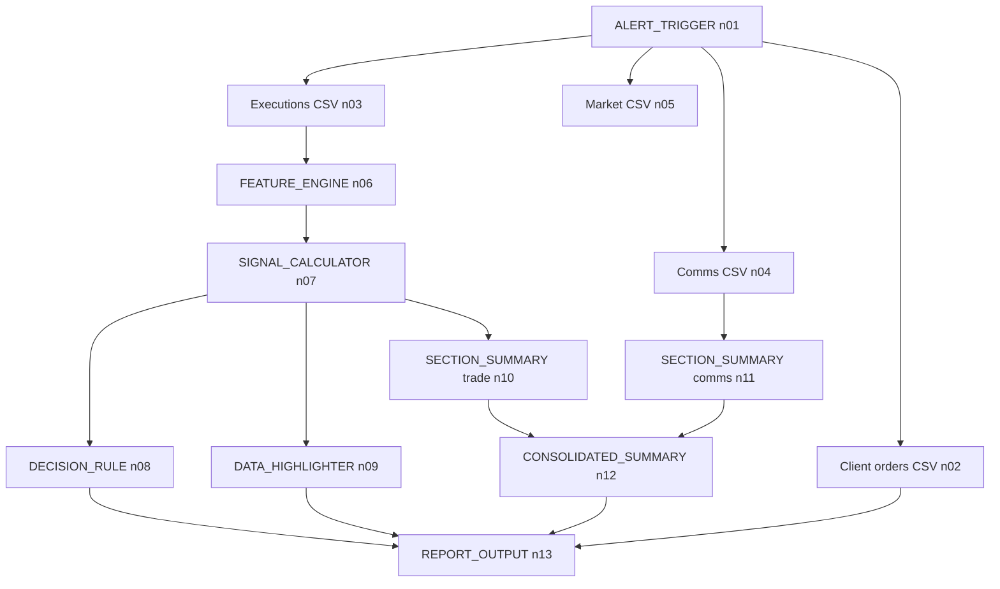

# fxfronew wordmap

**One-liner:** alert → four CSV collectors (orders, executions, comms, EBS) → feature engineering → FRO signal → decision → highlights + two section LLM summaries + executive roll-up → Excel `output/fxfronew_report.xlsx`.

**Keywords:** `ALERT_TRIGGER`, `EXECUTION_DATA_COLLECTOR`, `COMMS_COLLECTOR`, `MARKET_DATA_COLLECTOR`, `FEATURE_ENGINE`, `SIGNAL_CALCULATOR` (FRONT_RUNNING), `DECISION_RULE`, `DATA_HIGHLIGHTER`, `SECTION_SUMMARY` (trade + comms), `CONSOLIDATED_SUMMARY`, `REPORT_OUTPUT`.

| Node | Publishes |
| --- | --- |
| n02 | `client_orders` |
| n03 | `executions` |
| n04 | `comms_data` |
| n05 | `market_data` |
| n06 | `executions_enriched` |
| n07 | `signals` (and `flag_count` / disposition inputs) |
| n08 | branches + disposition |
| n09 | `signals_highlighted` (for report styling) |
| n10–n12 | `sections` + `executive_summary` |
| n13 | `output/fxfronew_report.xlsx` — tabs: Client Orders, Executions, Signals, Communications, Market Data (EBS) |

**UI/API:** load `fxfronew_workflow.json` from `GET /workflows/fxfronew_workflow.json`, run with `POST /run` (or `POST /run/stream`); `mock_csv_path` is resolved under `backend/` on the server so the JSON can keep `demo_data/...` as saved in the file.
